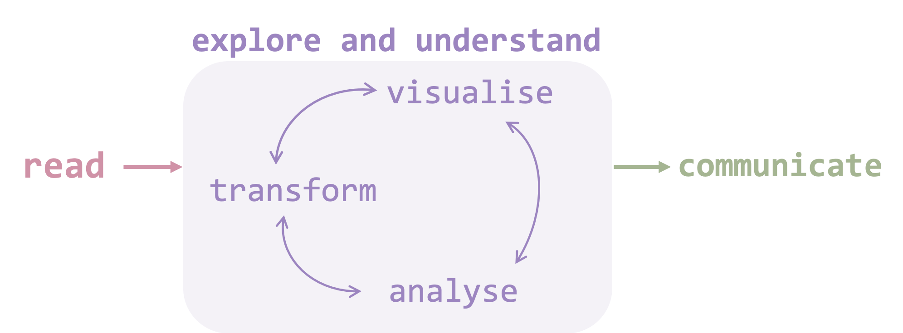
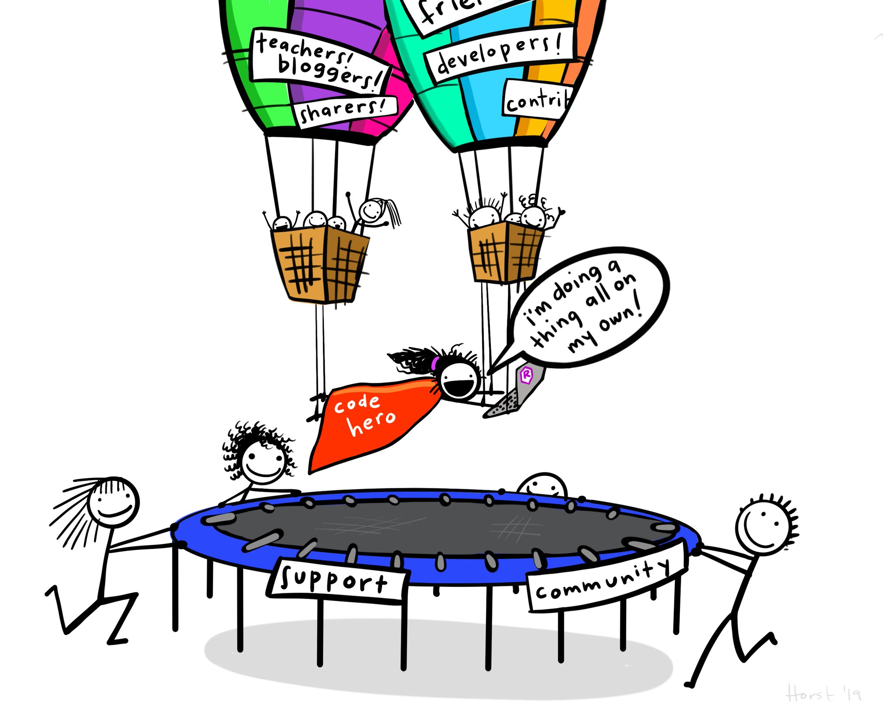

# Preamble

## Why we're doing this

We are doing this because we want extract insight out of data. We want to be able to _learn_ something from the information we have. 

This workshop---and my own learning in R---uses a number of key ideas from Hadley Wickham's _R for Data Science_.^[It can be accessed for free here: https://r4ds.had.co.nz] It is a wonderfully written book with a beginner audience in mind, and goes into far greater depth than this workshop can. However, with this workshop behind you I hope you'll be able to jump into _R for Data Science_ with confidence. From its introduction is this (adapted) graphic:


```{r why ar we doing this, echo=FALSE, fig.cap="", out.width = '100%'}

```

It lays out the project of any data science work:

* Find and read data into R.
* Explore data
  * Transform data: add things you want, and remove things you don't.
  * Visualise data: see what's happening in your data.
  * Analyse data: perform statistical analysis on your data to draw.
* Communicate your findings. 

And, importantly, we're here to have fun. To make fun and exciting visuals like 

[EXAMPLE FROM BBC? or elsewhere that have used R]


### Using a script-based program keeps a record of everything you do

R is a script-based language. You write down a list of instructions and it will follow, performing one action after another. This is different to 'point and click' software like Microsoft Excel, and it can feel a bit cumbersome.

In Excel, you can perform a series of steps:

* Open a file.
* Delete column that you don't need.
* Select all of your data and sort from highest to lowest.
* Delete all the rows that have missing values.
* Save your file.

But, there is **no record of any of this**. You might look back at the data in a week's time and not know what rows you have deleted. This is particularly important when you go to write up your metholodolgy for an assignment or thesis. You might not be able to _recreate_ your own work.

R is a script-based program. You write a list of instructions and R will follow it. This is wonderfully handy: 

* everything you have told it to do, it will do;
* you have recorded everything you have told it to do. 


### Using a free, open-sourced program is beneficial

There are many proprietary script-based programs for analysing data: Stata, SAS, Eviews, SPSS, Matlab. I imagine you will encouter a few of these during your undergrad.

#### Proprietry software costs money
They cost \$\$\$. If you are not at a university/workplace that has the program, you can’t use it. Even if you are at a place that has a license, you might have to use a special computer lab to use the program. Or you might have to pay for a license yourself.

Importantly, the cost means you are less likely to play around with the program in your spare time or for non-university activities. Google Sheets is a good example of this: people make budgets or plans in Sheets and, even if they're simple, you're learning as you go. 

#### Proprietry software is centrally controlled
Proprietary programs are also centrally controlled. Their functions are written by the company, and you can only use the set of functions they provide.^[Stata has made some grounds in this area, allowing `.ado` files written by users to be shared and used. But this is not near the levels of user-written functions in R.]

#### R is free
R is free. You can use it from any computer at any time. The analysis you do with R in your undergrad will be reusable when you graduate. It also means that you will be able to display the code of your analysis in a portfolio of work when you're looking for jobs in the future.

The free-ness of R means more people use it. R is known for a thriving community, meaning you can quickly search for `how to DO THE THING I WANT TO DO in R` and find an answer from wonderful people on the internet. People on the `R` internet are wonderful, and you'll soon feel like this:


```{r code hero, echo=FALSE, fig.cap="", out.width = '100%'}

```
_'Me "working independently"' by Allison Horst,  [\@allison_horst](https://twitter.com/allison_horst/status/1102447015248637953?s=12)_


#### R is open-source

R also thrives on user-written packages (collections of functions) that are available to everyone, for free. A literature review by Robert Muenchen for r4stats.com noted:^[http://www.r4stats.com/articles/popularity/ (the potential bias is indicated in its domain)] 

> In 2015, R added 1,357 packages...or approximately 27,642 functions. During 2015 alone, R added more functions than SAS Institute has written in its entire history.


Digression: ideally, as more and more faculties in universities around Australia make R their program-of-choice, you'll be able to spend more time mastering a single program (and properly understanding what you are _doing_ in that program), and less time fumbling around with a new language for each subject you take.


#### The problems with open-source software

The main downside to free, open-source software is that there are _many_ ways to do the same thing. If we had a dataset that looked at country population by year, and we only wanted to keep the year `2007`, we could do it in five ways (or more!):^[Adapted from https://www.r-bloggers.com/5-ways-to-subset-a-data-frame-in-r/]


* Subset using brackets by extracting the rows where year is equal to 2007
* Subset using brackets by omitting the rows where year is not equal to 2007
* Subset using brackets in combination with the `which()` function and the `%in%` operator
* Subset using the `subset()` function
* Subset using `filter()` function from the `dplyr` package

This makes searching for answers a little bit more difficult. However, this workshop uses `tidyverse` syntax (which includes `filter` from the `dplyr` package in the last example above), so I advise phrasing your Google search as `how to DO THE THING I WANT TO DO r tidyverse`. This will remove a least a _bit_ of the confusion.


## Getting started in R

Now that you are completely convinced that R is the **best**, let's get into it.

### How to install R and R Studio

You will need to download and install R and R Studio. (And you can skip this subsection if you already have!).

**R** is the language and the program. Think of it as the engine that powers the things you do. You can download it for:

* Mac: https://cran.rstudio.com/bin/macosx/R-3.5.2.pkg

* Windows: https://cranrstudio.com/bin/windows/base/R-3.5.2-win.exe

Once downloaded, follow the prompts to install. Restart your computer if required.

**R Studio** is the interface you will use R with. The technical term is an ‘integrated development environment’ (IDE) for R. Think of it as the dashboard that shows you all the things you’ve got going on in R. You can download it for:

* Mac: https://download1.rstudio.org/RStudio-1.1.463.dmg

* Windows: https://download1.rstudio.org/RStudio-1.1.463.exe  

Then, follow the prompts to install and restart if required.


### R Studio layout

R Studio is an integrated development environment (IDE) and is how we will interact with R. It looks like this:

```{r Rstudio looks like1, echo=FALSE, fig.cap="", out.width = '100%'}
knitr::include_graphics("../atlas/Rstudio-looks-like1.png")
```

The four panes are labelled in $\color{green}{\text{green}}$ :

* Top left: your **script**. This is where you will write your code.
* Bottom left: your **console**. This is where your code will be sent to, and where some of your output will show. You can also write code _directly_ into the console; but there will be no record of it in your script!
* Top right: your **environment**. This lists all the things that R knows about so far. If you define an object, it will appear here.
* Bottom right: a bit of a miscellaneous pane. **Files** list the files in your project. **Packages** lists the packages you have installed and loaded. **Viewer** is where our charts will be displayed. 


I know this can all look a bit intimidating the first time you see it. That's okay! We'll get to know R Studio more as we go through this course.


### Good folder structure and R _Projects_

Good folder structure is tedious and abstract and not-at-all-fun but it makes everything in the future easier. It simply means you have:

1. **One folder for each project**. Here, the example is `introduction_to_R`. Your projects might be something like `econometrics_assignment2` or `honours_thesis`. Whatever the project, everything you need for it is contained _within_ the main project folder. 
1. **A set of standardised subfolders**. For example, keep the `data` you are using in a folder called `data`. Keep `output` (tables, charts, etc) in an `output` folder. Note that you can set these up how you like: but consistency makes it easier for you to switch between projects and collaborate with others.

Your script will often ask for things on the computer. For example, "read in this dataset" or "save this chart to a place". For that, we have to tell the computer where _it is_. We can do that in two ways: 1) by explicitly setting a working directory (which is **not** the best way), and 2) by setting up a R Project (which **is** the best way to do it).

#### Excplicitly setting a working directory is a bad way to tell your computer where it is**:

This is sometimes done by 'setting a working directory'. This means having a line in your script that says 'this is where we are':

```{r, eval = FALSE}
setwd("Users/wfmackey/Documents/myRfolder/this_project_of_mine")
```

This is problematic and frustrating because your directory path won't be the same as your collaborators' or tutors' (unless you have the same name _and_ the same operating system!).

From Hadley Wickham's [_R for Data Science:_](https://r4ds.had.co.nz/workflow-projects.html#paths-and-directories)

> But you should never [use `setwd` to set a working directory] because there’s a better way; a way that also puts you on the path to managing your R work like an expert.

_^ That's you! You're already an expert._


#### Using R Projects is a good way to tell your computer where it is:

The best way to tell your computer _where it is_ is to use R Projects. This is a little file that lives in your project folder with the suffix `.Rproj`. Opening this file opens R and sets your working directory to _where it is_. 

This is beneficial because it means you don't have to write `setwd("Users/yourname/Documents/myRfolder/this_project_of_mine")` on every single script you write. It also means that your collaborators can open your project folder on their computer and all scripts will run without a hitch.

You can set up an R Project by clicking `File -> New Project` and following the prompts.

### Comments in your code

'Comments' are notes that live in your code and are preceded with `#`. R will ignore anything after the `#` symbol:

```{r comments}
# This is a good comment
12 + 2 # Those are great numbers
```

If we _forgot to_ use the `#` to 'comment' things, we would generate a bunch of errors as R tries to work out what you're on about:

```{r bad comment, error = TRUE}
This is a good comment
12 + 2 Those are great numbers
```


### Objects

Objects are 'things' that R knows about. They can be simple as a single number, or more complicated like an entire dataset. 

You can tell R about an object using the assign `<-` operator:

```{r assign}
# Define 'fave_number' as 12
fave_number <- 12
```


We have said: take the number `12` and assign it `<-` to the object `fave_number`. R will note this down, put `fave_number` in our environment and we will be able to use it when we want later. Like:

```{r use object1}
# Multiply 'fave_number' by 2
fave_number * 2
```

Or:

```{r use object2}
# Add 37 to 'fave_number'
fave_number + 37
```

We can have lots of objects stored in our environment, and we can call them whenever we want (after we have defined them):

```{r use objects}
least_fave_number <- 5
fave_number + least_fave_number
```


### Functions


A **function** takes **inputs** (aka 'arguments') and produces **outputs**.

We can use the `c` function to combine (concatenate) numbers into a series of numbers (a vector):

```{r c}
c(3, 4, 5)
```

The **output** above, like all output in this document, is preceded by `##` and then `[1]`, meaning the first line of output. Here, the **output** is the vector of numbers we entered into the `c` function. 

We can also **nest** functions, meaning we have one function inside another function. For example, we can combine numbers into a vector using the `c` function, then we can take the average (mean) of the vector:

```{r c mean}
# Use the c function to combine numbers (input) into a vector (output)
# Then take the mean of that vector:
mean(c(3, 4, 5))
```

But nested functions are a bit difficult to read. You have to start from the inside and read outwards. Alternatively, we could assign our vector to an `object` using the assign `<-`operator:

```{r}
# Use the c function to combine numbers (input) into a vector (output)
# And assign that to the object 'goodnumbers'
goodnumbers <- c(3, 4, 5)

# Then take the mean of goodnumbers
mean(goodnumbers)
```


This will make changes in our **environment** to the top-right: it adds the object `goodnumbers`. 

It will also produce output in the **console** to the bottom-left: the `mean` of `goodnumbers`. 

It should look something like this:


```{r Rstudio looks like2, echo=FALSE, fig.cap="", out.width = '100%'}
knitr::include_graphics("../atlas/Rstudio-looks-like2.png")
```


### Packages

R uses functions to do things. A package is a collection of functions. Some packages are installed when you install R, like `base` and `stats` (this is called "base R"). 

A wonderful benefit of R is being able to use the community's collection of functions. The `tidyverse` is a collection of functions that make data wrangling and visualisation much easier. And we can use this package for free.

Installing a package is like installing an app on your phone or computer: you need to do it, and you only need to do it once.

You can install a package using the `install.packages` function. Note that there will be lots of text that appears when installing a package. This text doesn't make great reading, but it lays out what the package is doing as it installs. If there is an error installing, this is where you'll find some (hopefully) useful infromation about why.

```{r install tidyverse, eval = FALSE}
install.packages("tidyverse")
```


Now we need to load the package using the `library` function, like opening an app you have installed. We do this every time (every 'session') we want to use it. 

```{r load tidyverse, message = TRUE, warning = FALSE}
library(tidyverse)
```

## Some notes before we start

In my experience learning R, there are two things I would like to prepare you for:


#### You will make lots of errors and this will be frustrating

R will follow your instructions to the tee. If you misspelll something or put an argument where it doesn^t belong, R will _try_ to do the thing you asked and it will fail. Hopefully, it will clearly tell you what happened; other times it will be vague. 

This means you will spend a lot of time **debugging** your code: you think what you've written makes sense, but you get an error. You try to work out what's gone wrong; you play around; you search the internet; you give up on R; you go outside and enjoy your R-free life; 


#### Make sure your brackets add up


________________________________________________

# We're coders now

We have installed R and R Studio; installed and loaded packages; and we know about objects and functions. 

We're coders. And now we just have to learn how to do more: 

>_This is a process you will continue as long as you’re using R_. 


