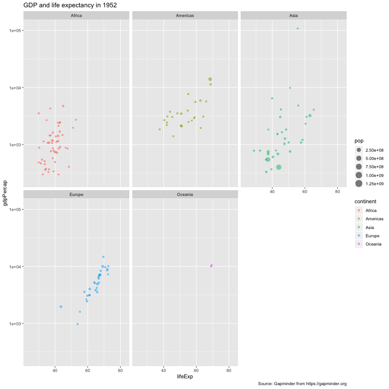

________________________________________________

# Reading and exploring with visuals

The preamble is meant to get you up-and-running in R, which is necessary. But it is a little bit tedious and boring. In this part, we will go through some fun things like creating graphics. It will follow:

1. Having a question.
1. Reading data into R.
1. Looking at our data plainly (like we would an Excel spreadsheet).
1. Exploring data visually and interactively.


## Read a CSV file into R

This uses the `read_csv` function and, here, we're only going to give it one argument: the path to the csv file you want to read in _quotation marks_. 

**Tip**: open quotation marks and hit `tab` to navigate to your file (and save you some typing).


```{r read_csv2, echo = TRUE, eval = FALSE}
read_csv("data/gapminder.csv")
```

```{r read_csv1, echo = FALSE, message = FALSE}
read_csv("../data/gapminder.csv")
```
 

Looks good! But what do we _have_?

We have a `tibble`: a tidy version of a column/row dataset. This means every observation is a row, and every variable is a column. 

The first line of output says that we have `r nrow(read_csv("../data/gapminder.csv"))` rows of observations $\times$ `r ncol(read_csv("../data/gapminder.csv"))` columns of varaibles. And from the output we read into R we can see that Afghanistan (`country`) had a life expectancy (`lifeExp`) of 28.8 in (`year`) 1952. 

The `read_csv` function seems to have worked pretty well, and our output makes sense. But the output---our data---isn't in our environment (on the top-right) yet because we didn't _assign it_ to anything. We assign something using `<-`, meaning we can call on it later.


```{r read_csv1 object, echo = FALSE, message=FALSE}
gapminder <- read_csv("../data/gapminder.csv") 
```


```{r read_csv2 object, eval = FALSE}
gapminder <- read_csv("data/gapminder.csv") 
```

Now it is in our environment on the top-right of our R Studio window. This means we can use `gapminder` to use it later when we want it. 


### Peeking at the data

Much like Excel, we can explore the raw `gapminder` dataset with our eyes.

`View` will open up a new tab that displays your dataset. You can scroll through it and look at each row and variable in your data.

```{r view, eval = FALSE}
View(gapminder)
```

If we just want a quick look, `head` will print just the first few observations. This is handy to check on things as you're going along.

```{r head}
head(gapminder)
```

`names` will display the names of all variables in the dataset (and is often the answer to _'what was that variable called again...'_)

```{r names}
names(gapminder)
```


## We should start by visualising our data

It is important to visualise your data to properly understand it. The **why** is explored more in Part 2. For now, let's get into it:

To visualise data we first need to have **questions**. Our first question is one of impartance: 

> Question 1: what is the relationship between life expectancy and income per person?

We have the data to answer this question. When we looked at the `gapminder` dataset, we saw that there were variables for life expectancy `lifeExp`, and for income per person `gdpPercap` in each county in each year. 

### Our first `ggplot`

So we can take the `gapminder` dataset, generate an empty plot using `ggplot` and fill it with a `point`: `lifeExp` on the `y` axis, and `gdpPercap` on the `x` axis:

```{r}
  ggplot(data = gapminder) +
  geom_point(mapping = aes(x = lifeExp,
                           y = gdpPercap))
```

What just happened there? We used the `ggplot2` package, which stands for the layered `g`rammar of `g`raphics `plot`^[You can read Hadley Wickham's _A Layered Grammar of Graphics [here](https://byrneslab.net/classes/biol607/readings/wickham_layered-grammar.pdf). This section is a quick and incomplete summary.]

Our plot has a few components:

* Data: our `gapminder` object.
* An `ggplot` using the `ggplot` function.
* A geometric object: we have chosen `geom_point` to plot dots.
  * Aesthetic mapping: within `geom_point` we have defined an aesthetic with `aes` and mapped the `x` axis to represent `lifeExp`, and the `y` axis to represent `gdpPercap`. 

We can see how that plays out by creating an empty plot:

```{r}
  ggplot()
```

Then fill it with out data:

```{r}
  ggplot(gapminder)
```

And then we have to explain how to _map_ the data to the plot using aesthetics `aes`, which we _add_ to the plot using `+` (noting that the `+` comes at the end of a line).

```{r}
  ggplot(data = gapminder) +
  geom_point(mapping = aes(x = lifeExp,
                           y = gdpPercap))
```

Start with an empty plot, then layer on a geometric object `geom` with some aesthetics `aes()`. We can add more layers to the same plot.


## Exploring interactively with `plotly`

We can use the `plotly` package to interactively explore the scatter plot. First, install the `plotly` package (remembering quotation marks when we install a package)

```{r, eval = FALSE}
install.packages("plotly")
```

Then load the package using `library`: 

```{r, message=FALSE}
library(plotly)
```

Then we define our normal-old-plot as an object using `<-`. 
This time we are going to map `country` to the `label` aesthetic so we can see which countries are which:

```{r, highlight=TRUE}
p <- ggplot(data = gapminder,
            mapping = aes(x = lifeExp,
                          y = gdpPercap,
                          label = country)) +
  geom_point()

```

And place the plot in the `ggplotly` function:

```{r}
ggplotly(p)
```

Now we can explore the plot! Move your mouse over the plot and work out what that high income/medium life expectancy country is.


### Changing scales

Our plots so far have been on 'linear' scales: they go up by the same amount for the whole scale.

But this might not always be the right scale for things that happen **exponentially**. For example, we might expect that income grows much faster than health does. So we decde to examine the relationship between (exponetial) GDP per capita and life expectancy. We want to use a `log10` `scale` on the `y` axis (where income is); so we add `+` the `scale_y_log10` function to our plot:


```{r}
  ggplot(data = gapminder,
         mapping = aes(x = lifeExp,
                       y = gdpPercap)) +
  geom_point() +
  scale_y_log10()
```


### Adding a trendline

To add another `geom` to the same plot, we use the _and_ `+` symbol, then add our new set of instructions on a new line. A trendline is called using `geom_smooth`:

```{r}
  ggplot(data = gapminder) +
  geom_point(mapping = aes(x = lifeExp,
                           y = gdpPercap)) +
  geom_smooth(mapping = aes(x = lifeExp,
                           y = gdpPercap)) +
  scale_y_log10()
```

**Note:** there is a whole library of `geom`s to explore at  https://ggplot2.tidyverse.org/reference/.


The trendline helps us with our question: we can see that, overall, the higher income is correlated with higher life expectancy. This is a result we would expect.

But the way we are looking at this data might be hiding some important insights. We should explore them.


### Adding **colour**

Our scatter plot so far shows two aesthetics (`aes`): `lifeExp` mapped to the `x` axis, and `gdpPercap` mapped to the `y` axis.

Let's look at our variable names again and explore if we can squeeze some more information out of this plot:

```{r}
names(gapminder)
```

It might be interesting to see how things vary by `continent`. So let's map `continent` to the `colour` aesthetic. We do this in the same way we mapped life expectancy and GDP per capita to the `x` and `y` axes:

```{r, message=FALSE}
  ggplot(data = gapminder) +
  geom_point(mapping = aes(x = lifeExp,
                           y = gdpPercap,
                           colour = continent)) +
  geom_smooth(mapping = aes(x = lifeExp,
                            y = gdpPercap,
                            colour = continent)) +
  scale_y_log10()
```

We have repeated ourselves a bit here. For each `geom` we have set the aesthetics: _"this is the x axis"_, _"this is the y axis"_ and _"this is the colour"_. To **save ourselves some typing** (and ensure we're being consistent)lh we can set the aesthetics in the first `ggplot` function. The `geom`s that follow will 'inherit' these aesthetics:

```{r, message=FALSE}
  ggplot(data = gapminder,
         mapping = aes(x = lifeExp,
                       y = gdpPercap,
                       colour = continent)) +
  geom_point() +
  geom_smooth() +
  scale_y_log10()
```


### Adding **size**

Just like we mapped colour to a country's continent, we can add size---the size of the points---to a variable (column) in our dataset. Let's map size to population (`pop`). 

```{r, message=FALSE}
  ggplot(data = gapminder,
         mapping = aes(x = lifeExp,
                       y = gdpPercap,
                       colour = continent,
                       size = pop)) +
  geom_point() +
  geom_smooth() +
  scale_y_log10()
```


### Setting global rules

We have mapped variables to `geom`s. This means they will take a value (`x`, `y`, `colour`, etc) depending on their variable's value (`lifeExp`, `gdpPercap`, `continent`, etc). 

But what if we just wanted to set a rule? Say, what if we wanted the colour of all points to be blue? Or the transparency of all points to be 50% regardless of their `country`, `lifeExp` or `gdpPercap`?

Remeber that `aes` values are mapping values: they map a variable to a thing, and we keep those mappings in the `aes()` function. 

If we want to set a rule outisde of an aesthetic, we do just that: 

```{r}
  ggplot(data = gapminder,
         mapping = aes(x = lifeExp,
                       y = gdpPercap,
                       colour = continent,
                       size = pop)) +
  geom_point(colour = "blue") + # colour = blue is outside of an aesthetic
  scale_y_log10() +
  labs(title = "Yay all of our points are blue!")
```


What would happen if we put `colour = "blue"` inside of `aes`? `ggplot` would do as it's told: it would _choose_ a colour for each value of the character string "blue". As there is only one value, our chart looks like this: 

```{r}
  ggplot(data = gapminder,
         mapping = aes(x = lifeExp,
                       y = gdpPercap,
                       colour = continent,
                       size = pop)) +
  geom_point(aes(colour = "blue")) + # oh no, colour = blue is now INSIDE of aes().
  scale_y_log10() +
  labs(title = "Oh no! None of our points are blue")
```


But we got good information from colouring continents by colour, so let's not throw that away. We can instead say "set the transparancy to 50%". Transparancy in the `ggplot`-world is `alpha`. So we'll set `alpha = 0.5` to the `geom_point` geometry. 

```{r}
  ggplot(data = gapminder,
         mapping = aes(x = lifeExp,
                       y = gdpPercap,
                       size = pop,
                       colour = continent)) +
  geom_point(alpha = 0.5) + # added this to change transparancy, outside of aes().
  scale_y_log10() +
  labs(title = "That's some nice transparency")
```


### Creating small multiples with `facets`

This is all getting a bit busy. It might be clearer to see each continent on its own separate chart. We can do this by adding a 'facet' to our plot: i.e. taking our chart, and plotting it 'around' `~` another variable.

```{r}
# Define chart as an object
chart <- ggplot(data = gapminder,
                mapping = aes(x = lifeExp,
                              y = gdpPercap,
                              colour = continent,
                              size = pop,
                              label = country)) +
         geom_point(alpha = 0.5) +
         scale_y_log10() +
         facet_wrap(~continent) +
         labs(title = "GDP per capita and life expectancy, by continent",
              caption = "Source: Gapminder from https://gapminder.org")


# View the chart
chart
```

The code above says: take the chart we (now) know and love, and do that for **each continent** in our dataset showing each seperately.

A trendline might be nice, and we can do that by adding it to our `chart` object:

```{r}
# Define chart as an object
chart_trend <- chart + 
               geom_smooth()

# View the chart
chart_trend
```


And, like we did above, we can make this plot _interactive_ with `ggplotly`:


```{r}
ggplotly(chart_trend)
```


## Making your plots dance

We defined a chart---an object uncreatively called `chart`---and, because we're only human, we would like to animate it into a `gif` to see it move over time.^[This is not a key feature of data science (yet), but it _is_ fun.]

Animating a plot is easy thanks to the `gganimate` package. It follows the same 'grammar of graphics' structure as `ggplot`, and we just tack it on the end of our plot-making.

First we install the `gganimate` package, which has been (re-)built by Thomas Lin Pedersen^[You can check out more of his work here: https://github.com/thomasp85]

```{r, eval = FALSE}
install.packages("gganimate")
```

Once the `gganimate` package is installed, we load it using `library` and add a few bits to our `chart`. _(Note that following it will take a minute or two to build the animation)_

```{r, eval = FALSE}
library(gganimate)

chart +
transition_time(year) +
labs(title = "GDP and life expectancy in {round(frame_time, 0)}")
```

And we can save the animation using `anim_save` (this will save the last animation you created by default).

```{r, eval = FALSE}
anim_save("atlas/gdp_life-exp.gif")
```

<!-- Generate animation seperately when required to speed up build -->

```{r, eval = FALSE, include=FALSE}
  library(gganimate)
  an <- 
  chart +
  transition_time(year) +
  labs(title = "GDP and life expectancy in {round(frame_time, 0)}")
  anim_save("../atlas/gdp_life-exp.gif", animation = an, height = 800, width = 800, nframes = 200)
```


```{r animation, echo=FALSE, fig.cap="", out.width = '100%'}

```


## Why we should start by visualising our data

From https://psyarxiv.com/hv3rm

```{r, eval = FALSE}
devtools::install_github("janhove/cannonball") 
```

```{r}
library(cannonball) 

corr_data <- plot_r(r = 0.36, n = 50, showdata = T)
```


