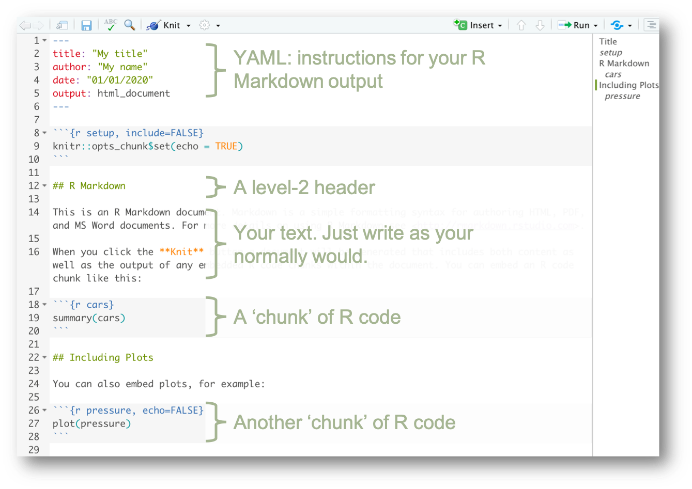

________________________________________________


# Part 2: this is a mess

We have produced some nice graphics looking at the relationship between a country's GDP per capita (per person) `gdpPercap`, and that country's life expectancy `lifeExp`. Now we want to look _deeper_.

## Transforming our data

Recall our `gapminder` dataset:
```{r}
gapminder
```

It has rows and columns; observations and variables. Now, close your eyes and picture the gapminder dataset.

1. Create a new column called `gdp`, which is `gdpPercapita` $\times$ `pop`.
1. Only keep rows from 2007
1. Then remove the 'year' column.

So: what happened to our dataset?

1. It got wider by adding a new variable.
1. It got shorter by removing all the years that weren't `2007`.
1. And it got thinner by removing a variable.

### 1. Adding a new variable

First, we created a new column called `gdp`. 

This uses the function `mutate`, which works like this:

```{r, eval = FALSE}
mutate(mydata, newvar = 10)
```

This means: take `mydata` and add a column `newvar`, which is equal to `10` for every observation. 

Thinking about the `gapminder` dataset, we could say that we wanted---for some reason---to make everyone richer with a `everyone_richer` variable that was the current GDP per capita `gdpPercap` $\times$ `1000`:

```{r}
mutate(gapminder, everyone_richer = gdpPercap * 1000)
```

Great---everone is richer! But note that this is not stored anywhere, the dataset with the `everyone_richer` variable was just printed on your screen.
But we saw it do an important thing: for each observation, it took _whatever the value of `gdpPercap` was_ and multiplied _that value_ by 1000.

To get to the thing we were _trying_ to do, add a `gdp` variable, we can use the `mutate` function **and** make sure we define it as an object:

```{r}
gap_gdp <- mutate(gapminder, gdp = gdpPercap * pop)
```

As above, this will take the `gapminder` dataset and add a new variable `gdp` which is equal to each observations GDP per capita multiplied by its population.

To make sure this as all worked, we can print the `head` of our dataset:

```{r}
head(gap_gdp)
```

And, like we have done many times before, we can visualise it:

```{r}
this_plot <- ggplot(gap_gdp,
                    aes(x = lifeExp,
                        y = gdp,
                        colour = continent,
                        label = country)) +
            geom_point() +
            scale_y_log10()

this_plot
```

Note that here we have defined an object called `this_plot` with our plot, and then called `this_plot` by writing it.

We could make it easier to explore interactively by again using `ggplotly`:

```{r}
ggplotly(this_plot) 
```


### 2. Filtering to keep only observations from 2007

Next, we want to `filter` our dataset to only keep observations from 2007. i.e. we want to know what the state of the world was before the global financial crisis. To do this, we use the (_suprise!_) `filter` function. Our first argument is the dataset we want to do something to, and we follow that by a **condition**:

```
filter(original_data, [CONDITION])
```

A condition is a statement for which some things are `TRUE` and some things are `FALSE`. A quick example of conditionals is below. `10` does NOT equal `20`, so the 'answer' to this is `FALSE`:

```{r conditionals1}
10 == 20
```

But `10` DOES equal `5` $\times$ `2`, so the following is `TRUE`:

```{r conditionals2}
10 == 5 * 2
```

We use two equals signs `==` to **require** something to be true, whereas we use a single equals sign `=` to **declare** something as true, which is why we use it to define new variables. For example:

```{r}
x = 10
x == 2
```

The first line reads "declare (or assign) `x` as `10`", which stores `x` in our envrironment and doesn't prouduce any output. The second line reads "`x` IS EQUAL TO `2`", which is not true (because we said that `x` was equal to `10`). It produces the somewhat-aggressive output `FALSE`.

We can also use the **does not equal sign** `!=` to say "this DOES NOT EQUAL that". Below we are saying that `10` DOES NOT EQUAL `5`$\times$`2`

```{r conditionals3}
10 != 5 * 2
```

[potentially go into detail on conditionals because the examples can be funs]

Anyway: we want to filter our data to only those observations for which the `year` of the observations IS EQUAL TO `2007`, or as we have learnt: `year == 2007`. The filter function does this:

```{r filter}
gap_gdp07 <- filter(gap_gdp, year == 2007)
```

And we can quickly check if that has worked:

```{r filter vis}
ggplot(gap_gdp07,
       aes(x = year,
           y = gdp)) +
  geom_point()
```

When we plot our new dataset `gap_gdp07` against `gdp` and `year`, we only have observations from 2007 (i.e. `year == 2007`). Great!


### 3. Removing the year variable

We can choose and drop variables in our dataset using the `select` function. This comes in handy when you're working with large datasets and your poor computer only has so much memory. Since we have already filtered our dataset to only include observations from 2007, we can drop the `year` variable.

```{r}
gap_gdp07_noYear <- select(gap_gdp07, -year)
```


And now wonderful! We have one dataset that excludes..., and another that ..., and _another_ that removes the year variable.

But, creating all these obscure datasets is odd. There is a better way.


## Piping it all together

This `%>%` is a pipe! The pipe is an odd concept and it is _wonderful_. Think of the things we've just done, where our goal was to create a new variable, keep observations from 2007 and drop the year variable:

```{r, eval = FALSE}
gap_gdp <- mutate(gapminder, gdp = gdpPercap * pop)
gap_gdp07 <- filter(gap_gdp, year == 2007)
gap_gdp07_noYear <- select(gap_gdp07, -year)
```

We've created a whole bunch of objects that we don't _really_ care about. We can neatly put this together with pipes `%>%`.

A pipe works by taking the thing behind it and making it the first argument in the function after it. So if we were simply adding `5 + 7` and then wanted to take the square root of that number, we could define an object:

```{r}
fave_number <- (5 + 7)
```

And take the square root of that object:

```{r}
sqrt(fave_number)
```

**OR** we could pipe `%>%` our number into the square root `sqrt` function:

```{r}
(5 + 7) %>% sqrt()
```

The pipe `%>%` takes the _things behind it_ and makes them the **first** argument in the next funtion. This is useful! Because we can quickly do all the things we wanted to do in our three-step program in one:

```{r pipe all}
gapminder07 <-  gapminder %>% 
                mutate(gdp = gdpPercap * pop) %>% 
                filter(year == 2007) %>% 
                select(-year)
```

Verbally, this says: assign `gapminder07` to the original `gapminder` dataset, but add a column called `gdp`, then filter to only include observations from `2007`, then drop the `year` variable.

This 'piping' means we can pretty quickly filter and adjust graphs. Recall that the `ggplot` function needs a dataset as its first argument, from Part 1:

```{r, message=FALSE}
  ggplot(data = gapminder,
         mapping = aes(x = lifeExp,
                       y = gdpPercap,
                       colour = continent,
                       size = pop)) +
  geom_point() +
  geom_smooth() +
  scale_y_log10()
```


So: `data` is the first argument. Whatever we pipe `%>%` into it will be the `data` argument. Which means we can use our new filtering skills before we plot something, and pipe `%>%` it into our `ggplot`:

```{r, message=FALSE}
gapminder %>% 
  filter(year == 2007) %>% 
  ggplot(mapping = aes(x = lifeExp,
                       y = gdpPercap,
                       colour = continent,
                       size = pop)) +
  geom_point() +
  geom_smooth() +
  scale_y_log10()
```


## Joining datasets together


## Making maps


## Making animations


## Using R Markdown

Using an R Markdown document means your analysis and your writing are in one place (this document is all written in R Markdown). 

R Markdown is a type of file that produces documents. It will process your R code and its output, then typeset/produce your file. It uses the same wonderful math language as LaTeX, too.^[A lot of academic work is written in a typesetting language called LaTeX. R Markdown is a bit simpler to get started with and is a solid alternative in most cases.]

To start an R Markdown document, click `File`->`New File`->`R Markdown`. This will set you up and explain a few things:

```{r Rmarkdown, echo=FALSE, fig.cap="", out.width = '100%'}

```

Headers are defined by `#` (for level 1), `##` (for level 2), etc:

```
# My main header

## A subheader
```


```{r out.width=c('50%', '50%'), fig.show='hold', eval = FALSE}
boxplot(1:10)
plot(rnorm(10))
```

## Making web apps

# bin


## Maths

At some point throughout your university life you will need to write equations in a document.
<br><br><br><br>
$A = (\pi * \lambda \times r^{4}) / \alpha $


<font size="1"> "Read a `.csv` file from the path `"data/gapminder.csv"` </font> 

