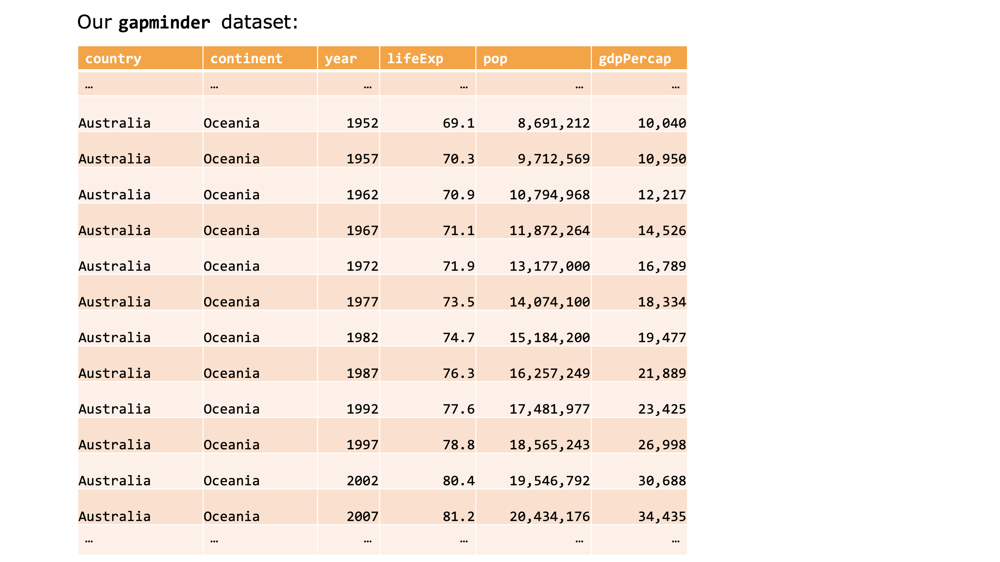
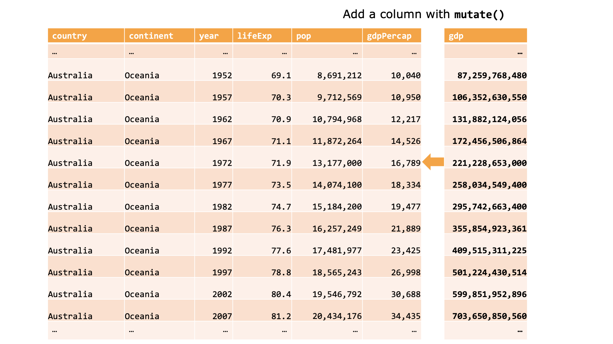
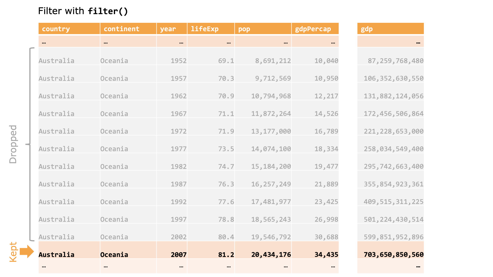
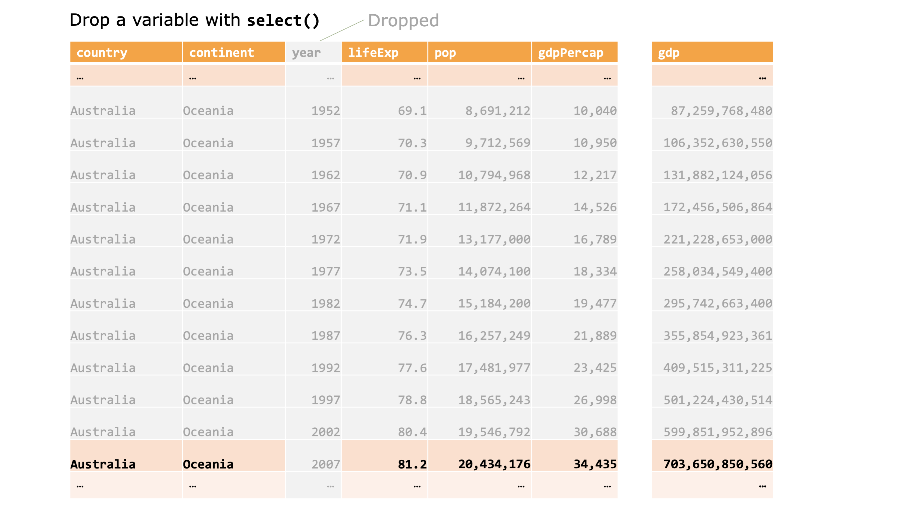

________________________________________________


# Part 2: this is a mess

We have produced some nice graphics looking at the relationship between a country's GDP per capita (per person) `gdpPercap`, and that country's life expectancy `lifeExp`. Now we want to look _deeper_.


## Looking at summary statistics (and why we need to visualise the data, too)


Most data is too 'big' to look at or make sense of individually. We often use summary statistic to get an _understanding_ for the data. You've done this before by taking the mean (average) of a series of numbers; or by looking at how they're correlated.

Below, we'll use a dataset from 

```{r}

library(datasauRus)

 datasaurus_dozen %>% 
    group_by(dataset) %>% 
    summarize(
      mean_x    = mean(x),
      mean_y    = mean(y),
      std_dev_x = sd(x),
      std_dev_y = sd(y),
      corr_x_y  = cor(x, y)
    )

  ggplot(datasaurus_dozen, aes(x=x, y=y, colour=dataset))+
    geom_point()+
    theme_void()+
    theme(legend.position = "none")+
    facet_wrap(~dataset, ncol=3) 
 
```


"never trust summary statistics alone; always visualize your data"

[obs not finished]

## Transforming our data

Recall our `gapminder` dataset:
```{r}
gapminder
```

It has rows and columns; observations and variables. Picture the `gapminder` dataset and:

1. Create a new column called `gdp`, which is `gdpPercapita` $\times$ `pop`.
1. Only keep rows from 2007
1. Then remove the 'year' column.

So: what happened to our `gapminder` dataset?

```{r dplyr1, echo=FALSE, fig.cap="", out.width = '80%'}

```


1. It got wider by adding a new variable:

```{r dplyr2, echo=FALSE, fig.cap="", out.width = '80%'}

```

2. It got shorter by removing all the years that weren't `2007`:

```{r dplyr3, echo=FALSE, fig.cap="", out.width = '80%'}

```


3. And it got thinner by removing a variable:

```{r dplyr4, echo=FALSE, fig.cap="", out.width = '80%'}

```

We'll explore through each of these steps slowly.


### 1. Adding a new variable

First, we created a new column called `gdp`. 

This uses the function `mutate`, which works like this:

```{r, eval = FALSE}
# Add a new variable called 'newvar'
mutate(mydata, newvar = 10)
```

This means: take `mydata` and add a column `newvar`, which is `10` for every observation. See how we use **one** equals sign `=` to **define** something. You can read this as: `newvar` IS `10`. _(We'll look at what two equals signs `==` means in the next section)._

Thinking about the `gapminder` dataset, we could say that we wanted---for some reason---to make everyone richer with a `everyone_richer` variable that was the current GDP per capita `gdpPercap` $\times$ `1000`:

```{r}
# To the 'gapminder' dataset, add a new variable called `everyone_richer'
mutate(gapminder, everyone_richer = gdpPercap * 1000)
```

Great---everone is richer! But note that this is not stored anywhere, the dataset with the `everyone_richer` variable was just printed on your screen.
But we saw it do an important thing: for each observation, it took _whatever the value of `gdpPercap` was_ and multiplied _that value_ by 1000.

To get to the thing we were _trying_ to do, add a `gdp` variable, we can use the `mutate` function **and** make sure we define it as an object:

```{r}
# To the 'gapminder' dataset, add a new variable called `pop'
# Define this as 'gap_gdp'
gap_gdp <- mutate(gapminder, gdp = gdpPercap * pop)
```

As above, this will take the `gapminder` dataset and add a new variable `gdp` which is equal to each observations GDP per capita multiplied by its population.

To make sure this as all worked, we can print the `head` of our dataset:

```{r}
# Look at the first few rows of `gap_gdp'
head(gap_gdp)
```

And, like we have done many times before, we can visualise it:

```{r}
# Plot 'gap_gdp' and define as 'this_plot'
this_plot <- ggplot(gap_gdp,
                    aes(x = lifeExp,
                        y = gdp,
                        colour = continent,
                        label = country)) +
            geom_point() +
            scale_y_log10()

# Look at 'this_plot'
this_plot
```

Note that here we have defined an object called `this_plot` with our plot, and then called `this_plot` by writing it.

We could make it easier to explore interactively by again using `ggplotly`:

```{r}
# Use ggplotly to look at 'this_plot'
ggplotly(this_plot) 
```


### 2. Filtering to keep only observations from 2007

Next, we want to `filter` our dataset to only keep observations from 2007. i.e. we want to know what the state of the world was before the global financial crisis. To do this, we use the (_suprise!_) `filter` function. Our first argument is the dataset we want to do something to, and we follow that by a **condition**:

```
filter(original_data, [CONDITION])
```
#### Conditional statements
A conditional statement is one for which some things are `TRUE` and some things are `FALSE`. A quick example of conditionals is below. 

`10` does NOT equal `20`, so the 'answer' to this is `FALSE`:

```{r conditionals1}
10 == 20
```

See how we are using **two** equals signs `==` to **declare** something **is equal to**. You can read the above as: `10` IS EQUAL TO `20`. 

But `10` DOES equal `5` $\times$ `2`, so the this is `TRUE`:

```{r conditionals2}
10 == 5 * 2
```

We use two equals signs `==` to **require** something to be true, whereas we use a single equals sign `=` to **declare** something as true, which is why we use it to define new variables. For example:

```{r}
x = 10
x == 2
```

The first line reads "declare (or assign) `x` as `10`", which stores `x` in our envrironment and doesn't prouduce any output. The second line reads "`x` IS EQUAL TO `2`", which is not true (because we said that `x` was equal to `10`). It produces the somewhat-aggressive output `FALSE`.

We can also use the **does not equal sign** `!=` to say "this DOES NOT EQUAL that". Below we are saying that `10` DOES NOT EQUAL `5`$\times$`2`

```{r conditionals3}
10 != 5 * 2
```

[potentially go into detail on conditionals because the examples can be funs]

Anyway: we want to filter our data to only those observations for which the `year` of the observations IS EQUAL TO `2007`, or as we have learnt: `year == 2007`. The filter function does this:

```{r filter}
gap_gdp07 <- filter(gap_gdp, year == 2007)
```

And we can quickly check if that has worked by looking at the `gap_gdp07` dataset, selecting `$` only the `year` variable:

```{r filter vector}
gap_gdp07$year
```

This reads: _Take the `gap_gdp07` dataset and choose `$` the `year` column._

It looks like they're all `2007`---which is exactly what we wanted. We could also wrap the code above in the `unique` function, which removes any duplicates and _only_ shows unique values:

```{r filter unique}
unique(gap_gdp07$year)
```

This reads: _I want to look at each `unique` value (i.e. remove any duplicates) of the `year` column `$` of the `gap_gdp07` dataset._

Great! There's only one unique year number in the `gap_gdp07` dataset. Just what we wanted.


### 3. Removing the year variable

We can choose and drop variables in our dataset using the `select` function. This comes in handy when you're working with large datasets and your poor computer only has so much memory. Since we have already filtered our dataset to only include observations from 2007, we can drop the `year` variable.

```{r}
gap_gdp07_noYear <- select(gap_gdp07, -year)
```

This reads: define `gap_gdp07_noYear` as the `gap_gdp07` dataset and **negatively select** (drop) the `year` variable.


Wonderful! We have done the three things we wanted: we have one dataset that adds the `gdp` variable; the next that only keeps observations from `2007`; and a _final_ one that removes the `year` variable.

But, creating all these obscure datasets is odd. There is a better way.


## Piping it all together

This `%>%` is a pipe! The pipe is an odd concept and it is _wonderful_. Think of the things we've just done, where our goal was to create a new variable, keep observations from 2007 and drop the year variable:

```{r, eval = FALSE}
gap_gdp          <- mutate(gapminder, gdp = gdpPercap * pop)
gap_gdp07        <- filter(gap_gdp, year == 2007)
gap_gdp07_noYear <- select(gap_gdp07, -year)
```

We've created a whole bunch of objects that we don't _really_ care about. We can neatly put this together with pipes `%>%`.

A pipe works by taking the thing behind it and making it the first argument in the function after it. So if we were simply adding `5 + 7` and then wanted to take the square root of that number, we could define an object:

```{r}
fave_number <- 5 + 7
```

And take the square root of that object:

```{r}
sqrt(fave_number)
```

**OR** we could pipe `%>%` our number into the square root `sqrt` function:

```{r}
5 + 7 %>% sqrt()
```

The pipe `%>%` takes the _things behind it_ and makes them the _first_ argument in the next funtion. This is useful! Because we can do all the things we wanted to do in our three-step program in one:

```{r pipe all}
gapminder07 <-  gapminder %>% # Take the gapminder dataset...
                mutate(gdp = gdpPercap * pop) %>%  # and add a new variable 'gdp'...
                filter(year == 2007) %>% # and filter to keep only observations from 2007
                select(-year) # and drop the year variable
```

Verbally, this says: assign `gapminder07` to the original `gapminder` dataset, but add a column called `gdp`, then filter to only include observations from `2007`, then drop the `year` variable.

This 'piping' means we can pretty quickly filter and adjust graphs. Recall that the `ggplot` function needs a dataset as its first argument, from Part 1:

```{r, message=FALSE}
  ggplot(data = gapminder,
         mapping = aes(x = lifeExp,
                       y = gdpPercap,
                       colour = continent,
                       size = pop)) +
  geom_point() +
  geom_smooth() +
  scale_y_log10()
```


So: `data` is the first argument. Whatever we pipe `%>%` into it will be the `data` argument. Which means we can use our new filtering skills before we plot something, and pipe `%>%` it into our `ggplot`:

```{r, message=FALSE}
gapminder %>% 
  filter(year == 2007) %>% 
  ggplot(mapping = aes(x = lifeExp,
                       y = gdpPercap,
                       colour = continent,
                       size = pop)) +
  geom_point() +
  geom_smooth() +
  scale_y_log10()
```


## Joining datasets together

We have our `gapminder` dataset that contains information about countries in different years. Now, let's say we have _another_ dataset---`maps`---that contains information about the geometry (i.e. map information) about those countries. We could use _both_ of those datasets together to plot a map of `lifeExp` around the world _if only_ we could join the two datasets together.

We can do this by joining our new `map` dataset with our original `gapminder` dataset using `left_join`^[You can explore the full gamut of joning types here: https://dplyr.tidyverse.org/reference/join.html. A _very handy_ superhero-themed set of examples is here: https://stat545.com/bit001_dplyr-cheatsheet.html]

First, we read the maps dataset into our environment. Note that this time the data format is `Rds`, so we use the `read_rds` function^[This is also from the `readr` package in the `tidyverse`. An `rds` file has the suffix `.Rds` and is made to be read into R. You can find out more about this kind of file here: https://readr.tidyverse.org/reference/read_rds.html]

```{r, eval = FALSE}
map <- read_rds("data/worldmap_data.Rds")
```


```{r, include = FALSE}
map <- read_rds("../data/worldmap_data.Rds")
```

What, exactly, is this object? We can use the `class` function to ask:

```{r}
class(map)
```


It's an `sf` ('simple features') object **and** a `data.frame` object! This is just like a `tibble` object, but with a special `geometry` variable. The `geometry` variable contains---surprise!---a bunch of spatial information about each observation. The `geometry` column contains a series of lines that make up the border of each country: one small straight line that connects to another small straight line that connects to another small straight line, and so on.

We would like to connect this spatial `map` data to our `gapminder` dataset. We can do this with by taking the original (`left`) dataset `gapminder` and connecting the `map` dataset to it. By using the function `left_join`:

```{r}
gapmap <- full_join(gapminder, map, by = "country")
```

We are saying:

* In the first row of `gapminder` look for a match in the dataset `map`, `by` `country`. If you find one, connect all columns in `map`. If not, move on.
  - Here, it will look for `Afghanistan` in the `map` object and it will find one observation and it will connect all those `Afghanistan` `map` variables to our dataset.
* In the second row of `gapminder` look for a match...(it will do the same thing for each row).

[A more detailed explanation about joining datsets and relational data can be found at https://r4ds.had.co.nz/relational-data.html]


## Making maps

We have a dataset that contains information about various countries (`gdpPercap`, `lifeExp`, etc). We joined it to a dataset that contains spatial data for those countries in the `geometry` variable. This means we can use `ggplot` like we have been doing before, but this time with a different `geom`: `geom_sf`, which will plot your geometries (ie plot your map). 

We want to plot GDP per capita (`gdpPercap`) in 2007. So we first filter our data 

```{r, eval = FALSE, include = FALSE}
library(sf)

gapmap07 <- gapmap %>% filter(year == 2007)

gapmap_plot <- gapmap07 %>% 
               ggplot() +
               geom_sf(aes(geometry = geometry, 
                           fill = gdpPercap), 
                       lwd = 0) # sets the line-width to zero

gapmap_plot
```


```{r}
library(sf)

gapmap07 <- gapmap %>% filter(year == 2007)

gapmap_plot <- gapmap07 %>% 
               ggplot() +
               geom_sf(aes(geometry = geometry, 
                           fill = gdpPercap), 
                       lwd = 0) # sets the line-width to zero

gapmap_plot
```

We can see some issues with our map. We have a _bunch_ of missing data: mainly from eastern Europe and central Afria. We also 

```{r}
all07 <- read_csv("../data/gapall07.csv")

allmap <- left_join(all07, map)

map07 <- 
allmap %>% 
  filter(year == 2007) %>% 
  ggplot() +
  geom_sf(aes(geometry = geometry, 
              fill = gdpPercap), 
          lwd = 0) + # sets the line-width to zero
  theme(legend.position = "top")

map07
```


