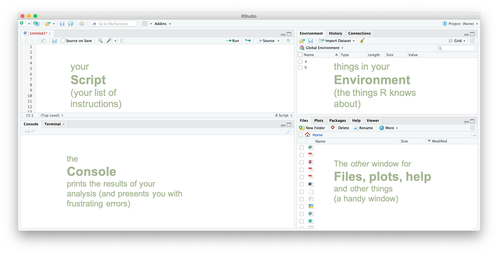
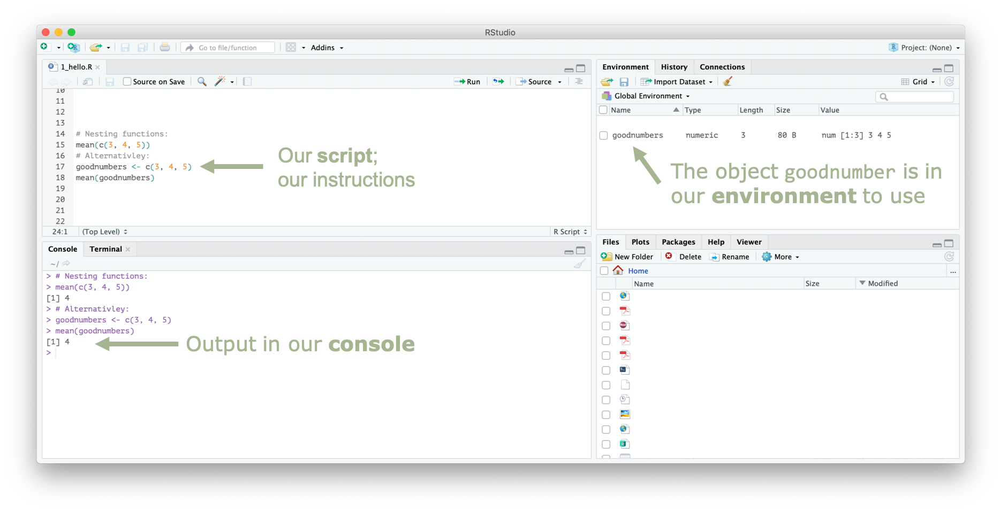

```{r setup, include=FALSE}
knitr::opts_chunk$set(echo = TRUE)
```

# Preamble

## Why we are doing this

### Using a script-based program keeps a record of everything you do

R is a script-based language. You write down a list of instructions and it will follow, performing one action after another. This is different to 'point and click' software like Microsoft Excel, and it can feel a bit cumbersome.

In Excel, you can perform a series of steps:

* Open a file.
* Delete column that you don't need.
* Select all of your data and sort from highest to lowest.
* Delete all the rows that have missing values.
* Save your file.

But, there is no record of any of this. You might look back at the data in a week's time and not know what rows you have deleted. This is particularly important when you go to write up your metholodolgy for an assignment or thesis. You might not be able to _recreate_ your own work.

R is a script-based program. You write a list of instructions and R will follow it. This is wonderfully handy: 

* everything you have told it to do, it will do;
* you have recorded everything you have told it to do. 


### Using a free, open-sourced program in beneficial

There are many proprietary script-based programs for analysing data: Stata, SAS, Eviews, SPSS, Matlab.

They cost \$\$\$. If you are not at a university/workplace that has the program, you can’t use it. Or you will have to pay for a license yourself.

R is free, open-source and powerful. In the past five years, it has also become easier to use. 

Proprietary programs are also centrally controlled. 

The select functions are written by the company, and you can only use the set of functions they provide.

R thrives on user-written packages (collections of functions) that are available to everyone, for free. From a recent study:

> In 2015, R added 1,357 packages, counting only CRAN, or approximately 27,642 functions. During 2015 alone, R added more functions than SAS Institute has written in its entire history.^[r4stats.com/articles/popularity/ (the potential bias is indicated in its domain)]


## Getting started in R

### How to install R and R Studio

You will need to download and install R and R Studio.

**R** is the language and the program. Think of it as the engine that powers the things you do. You can download it for:

* Mac: https://cran.rstudio.com/bin/macosx/R-3.5.2.pkg

* Windows: https://cranrstudio.com/bin/windows/base/R-3.5.2-win.exe

Once downloaded, follow the prompts to install. Restart your computer if required.

**R Studio** is the interface you will use R with. The technical term is an ‘integrated development environment’ (IDE) for R. Think of it as the dashboard that shows you all the things you’ve got going on in R. You can download it for:

* Mac: https://download1.rstudio.org/RStudio-1.1.463.dmg

* Windows: https://download1.rstudio.org/RStudio-1.1.463.exe  

Then, follow the prompts to install and restart if required.


### Good folder structure and R _Projects_


Good folder structure is tedious and abstract and not-at-all-fun but it makes everything in the future easier. It simply means you have:

1. **One folder for each project**. Here, the example is `introduction_to_R`. But your projects will likely be `econometrics_assignment2` or `honours_thesis`. Whatever the project, everything you need for the it is contained _within_ the folder. 
1. **A set of standardised subfolder**. For example, keep the data you are calling in a folder called `data`. Keep output (tables, charts, etc) in an `output` folder. Note that you can set these up how you like: but consistency makes it easier for you to switch between projects.

Your script will often ask for things on the computer. For example, "read in this dataset" or "save this chart to a place". For that, we have to tell the computer where _it is_.

**A bad way to tell your computer where it is**:

This is sometimes done by 'setting a working directory'. This means having a line in your script that says 'this is where we are':

```{r, eval = FALSE}
setwd("Users/wfmackey/Documents/myRfolder/this_project_of_mine")
```

This is problematic and frustrating, especially if you are collaborating. Your directory path won't be the same as your collaborators or tutors (unless you have the same name _and_ the same operating system!).

From Hadley Wickham's excellent [_R for Data Science:_](https://r4ds.had.co.nz/workflow-projects.html#paths-and-directories)

> But you should never do this because there’s a better way; a way that also puts you on the path to managing your R work like an expert.

**A better way to tell your computer where it is**:

The best way to tell your computer _where it is_ is to use R Projects. This is a little file that lives in your project folder with the suffix `.Rproj`. Opening this file opens R and sets your working directory to _where it is_. 

This is beneficial because it means you don't have to write `setwd("Users/yourname/Documents/myRfolder/this_project_of_mine")` on every single script you write. It also means that your collaborators can open your project folder on their computer and all scripts will run without a hitch.


### R Studio layout

R Studio is an integrated development environment (IDE) and is how we will interact with R. It looks like this:

```{r Rstudio looks like1, echo=FALSE, fig.cap="", out.width = '100%'}

```

The four panes are labelled in $\color{green}{\text{green}}$:

* Top left: your **script**. This is where you will write your code.
* Bottom left: your **console**. This is where your code will be sent to, and where some of your output will show. You can also write code _directly_ into the console; but there will be no record of it in your script!
* Top right: your **environment**. This lists all the things that R knows about so far. If you define an object, it will appear here. 
* Top left: a bit of a miscellaneous pane. **Files** list the files in your project. **Packages** lists the packages you have installed and loaded. **Viewer** is where our charts will be displayed. 


I know this call all look a bit intimidating the first time you see it. That's okay! We'll get to know R Studio more.

### Objects

An 

### Functions

A **function** takes inputs (**arguments**) and produces **outputs**.

We can use the `c` function to combine (concatenate) numbers into a series of numbers (a vector):

```{r c}
# Use the c function to combine numers (input) into a vector (output):
c(3, 4, 4)
```

The **output** above, like all output in this document is preceded by `##` and then `[1]`, meaning the first line of output. Here, the output is the vector of numbers we entered into the `c` function. 

We can also **nest** functions, meaning we have one function inside another function. For example, we can combine numbers into a vector using the `c` function, then we can take the average (mean) of the vector:

```{r c mean}
# Use the c function to combine numers (input) into a vector (output)
# Then take the mean of that vector:
mean(c(3, 4, 5))
```

But nested functions are a bit difficult to read. You have to start from the inside and read outwards. Alternatively, we could assign our vector to an `object` using the assign `<-`operator:

```{r}
# Use the c function to combine numers (input) into a vector (output)
# And assign that to the object 'goodnumbers'
goodnumbers <- c(3, 4, 5)

# Then take the mean of goodnumbers
mean(goodnumbers)
```


This will make changes in our **Environment**: it adds the object `goodnumbers`. It will also produce output in the **Console**: the `mean` of `goodnumbers`. It should look something like this:


```{r Rstudio looks like2, echo=FALSE, fig.cap="", out.width = '100%'}

```


### Packages

Installing a package is like installing an app on your phone or computer: you need to do it, and you only need to do it once.

You can install a package using the `install.packages` function. Note that there will be lots of text that appears when installing a package 

```{r install tidyverse, eval = FALSE}
install.packages("tidyverse")
```


Now we need to load it using the `library` function; like opening an app you have installed on your phone. We do this every time (every 'session') we want to use it.

Notice below that we received some messages and warnings when we loaded the 

```{r load tidyverse, collapse=TRUE}
library(tidyverse)
```


# Part 1: Reading and exploring with visuals

This 

## Read a CSV file into R

This uses the `read_csv` function and, here, we're only going to give it one argument: the path to the csv file you want to read _in quotation marks_. 

**Tip**: open quotation marks and hit `tab` to choose your file (and save you some typing).

```{r read_csv}
read_csv("data/gapminder.csv")
```

 

Looks good! But it isn't in our Environment (on the right) yet because we didn't _assign it_ to anything. We assign something using `<-`. It 


```{r read_csv object}
gapminder <- read_csv("data/gapminder.csv") 
                                            
```

Now it is in our Global Environment over there --->    wooh!

### Peeking at the data

Much like Excel, we can explore the `gapminder` dataset with our eyes.

`View` will open up a new tab that displays your dataset. You can scroll through it.

```{r view, eval = FALSE}
View(gapminder)
```

`head` will print just the first few observations. This is handy to check on things as you're going along.

```{r head}
head(gapminder)
```

`names` will display the names of all variables in the dataset (and is often the answe to 'what was that variable called again...')

```{r names}
names(gapminder)
```

## Visualising the data

```{r}
## Scatter plot
gapminder %>% 
  ggplot(aes(x = lifeExp,
             y = gdpPercap)) +
  geom_point()
```

## Exploring further with `plotly`

```{r, message=FALSE}
library(plotly)
```

```{r, highlight=TRUE}
p <- gapminder %>% 
  ggplot(aes(x = lifeExp,
             y = gdpPercap,
             label = country)) +
  geom_point()


ggplotly(p)
```

## Look at the gapminder dataset. 
Now close your eyes and picture the gapminder dataset:
* Add a new column to the right with the name 'my_column'. 
* Only keep rows from 2007
* Then remove the 'year' column


# Putting it all together with pipes %>% 


```{r}
gapminder07 <- gapminder %>%         # Assign gapminder07 to: the gapminder dataset, then
  
  mutate(gdp = gdpPercap * pop) %>%  # create a new column called gdp, then
  
  filter(year == 2007) %>%           # keep only observations from 2007, then
  
  select(-gdpPercap)                 # drop the gdpPercap variable (negative select)

```

## Changing the look of our plots

We want to make our plots as clear as possible...


```{r}

library(scales)
# with a log scale
gapminder07 %>% 
  ggplot(aes(x = lifeExp,
             y = gdp)) +
  geom_point() +
  scale_y_log10(label = comma)


# with colour
gapminder07 %>% 
  ggplot(aes(x = lifeExp,
             y = gdp,
             colour = continent)) +
  geom_point() +
  geom_line(aes(group = country)) +
  scale_y_log10(label = comma)


# with colour and facet
gapminder07 %>% 
  ggplot(aes(x = lifeExp,
             y = gdp,
             colour = continent)) +
  geom_point() +
  geom_line(aes(group = country)) +
  scale_y_log10(label = comma)+ 
  facet_wrap(~ continent)


# with colour and facet
gapminder07 %>% 
  mutate(decade = signif(year, 3)) %>% 
  ggplot(aes(x = lifeExp,
             y = gdp,
             colour = continent,
             size = pop)) +
  geom_point() +
  geom_line(aes(group = country)) +
  scale_y_log10(label = comma)+ 
  facet_grid(decade ~ continent)


# with colour
gapminder07 %>% 
  ggplot(aes(x = lifeExp,
             y = gdp,
             colour = continent)) +
  geom_point(alpha = 0.5) +
  geom_line(aes(group = country)) +
  scale_y_log10() +
  facet_wrap(~ continent)

```


# Part 2: 

# Joining datasets together


# bin

## R Markdown

```{r out.width=c('50%', '50%'), fig.show='hold', eval = FALSE}
boxplot(1:10)
plot(rnorm(10))
```

## Maths

At some point throughout your university life you will need to write equations in a document.
<br><br><br><br>
$A = (\pi * \lambda \times r^{4}) / \alpha $


<font size="1"> "Read a `.csv` file from the path `"data/gapminder.csv"` </font> 

