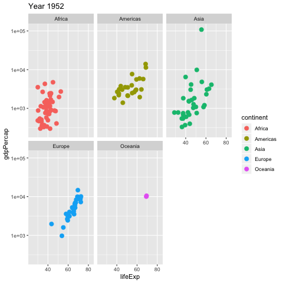

```{r setup, include=FALSE}
knitr::opts_chunk$set(echo = TRUE, message = FALSE, warning = FALSE)
```

# Part 1: Basics
  
## Writing a script

```{r}
    # Hello I am starting my R script
    
    goodnumber <- 119
    
    2 * goodnumber
```


## Functions

```{r}
    # Combine
    c(3, 4, 5)
    
    # Mean
    mean(c(3, 4, 5))
    
    # In steps
    goodnumbers <- c(3, 4, 5)
    mean(goodnumbers)
    
    # Looking at some data
    print(mtcars)
    
    # Find out more about functions or data
    ?mtcars
    ?mean
    
    # Look at a single column with $
    print(mtcars$mpg)
    
    # Get the mean of a single column
    mean(mtcars$mpg)
```
    
## Packages
    
### Install the `tidyverse` package
You will need internet for this part.


```{r, eval = FALSE}
install.packages("tidyverse")
```

    
### Load the `tidyverse` package

```{r, warning = FALSE, message = FALSE}
# Load the package
library(tidyverse)
```
    
    
# Part 2: Read data 
    
## Reading data into R
Tip: when you open quotation marks "", hit TAB to navigate to a file.
```{r}
gapminder <- read_csv("data/gapminder.csv")
```


Looking at our data

```{r}
# Looking at our data
head(gapminder)
```

    
# Part 3: Visualise

## Using `ggplot`

```{r}
    # Simple plot
    ggplot(data = gapminder) + 
      aes(x = lifeExp, 
          y = gdpPercap) +
      geom_point()
    
    # Save your plot
    ggsave("atlas/simple_plot.pdf")
```    
   

Adding more and assigning to an object, `p`:

```{r} 
# Adding more and assigning to p
p <- ggplot(data = gapminder) +
  aes(x = lifeExp,
      y = gdpPercap,
      colour = continent,
      size = pop) +
  geom_point(alpha = 0.3) +
  geom_smooth() +
  scale_y_log10() +
  facet_wrap(~continent)

# Plotting p
p
```


### Adding facets

```{r}
p_facet <- p +
           facet_wrap(~continent)
```


### Exercise

```{r}
# Exercise
 ggplot(data = gapminder) +
  aes(x = gdpPercap,
      y = pop,
      colour = lifeExp,
      group = country) +
  geom_point(alpha = 0.8, 
             size = 2) +
  scale_y_log10() +
  scale_x_log10() +
  theme_dark()
```


## Interactive charts with `plotly`

Install:
```{r, eval = FALSE}
install.packages("plotly")
```

Load:
```{r}
library(plotly)
```
  
Take our p plot and put it inside ggplotly:
```{r}
ggplotly(p_facet)
```


  

## Animation


Install required packages.
```{r, eval = FALSE}
install.packages("gifski")
install.packages("png")
install.packages("gganimate")
```

Load `gganimate` package. The `gifski` and `png` packages are background packages used by `gganimate` and don't need to be loaded:

```{r, warning = FALSE, message = FALSE}
library(gganimate)
```

### Create the animation

Create a normal `ggplot` and add the `transition_time` line to animate:

```{r, eval = FALSE}
dancing_gapminder <- ggplot(data = gapminder) +
  aes(x = lifeExp,
      y = gdpPercap,
      colour = continent) +
  geom_point(size = 3) +
  scale_y_log10() +
  facet_wrap(~continent) +
  labs(title = "Year {round(frame_time, 0)}") +
  # This is the animation part:
  transition_time(year)

# View your animation
dancing_gapminder

# Save your animation
anim_save("atlas/dancing_gapminder.gif")
```

```{r animation, echo=FALSE, fig.cap="", out.width = '100%'}

```


# Part 4: Transform

Adding a column

```{r}
gapminder07 <- gapminder %>% 
  mutate(gdp = gdpPercap * pop)
```

Filter to keep only `2007`
```{r}
gapminder07 <- gapminder07 %>% 
  filter(year == 2007)
```

Drop the variable `gdpPercap`

```{r}
gapminder07 <- gapminder07 %>% 
  select(-gdpPercap)
```

### Doing it all together:

```{r}
gapminder07 <- gapminder %>% 
  mutate(gdp = gdpPercap * pop) %>% 
  filter(year == 2007) %>% 
  select(-gdpPercap)
```

### Exercise

```{r}
  # Create dataset
  aus <- gapminder %>% 
    filter(country == "Australia") %>% 
    mutate(gdpPClife = gdpPercap / lifeExp)
  
  # Plot
  aus %>% 
    ggplot() +
    aes(gdpPClife,
        pop,
        colour = year) +
    geom_point() +
    geom_line()
```


    
# Part 5: Maps

## Read the `sf` object

We use the `sf` package to wrangle mapping data:

```{r, eval = FALSE}
install.packages("sf")
```

Load it:    
```{r, warning = FALSE, message = FALSE}
library(sf)
```

Read `gapminder` + `geometry` data:  
```{r}
gapmap <- read_rds("data/gapmapdata.Rds")
```


Look at the names of the `sf` object:

```{r}
names(gapmap)
```


## Plot an empty map using geom_sf

```{r}
ggplot(gapmap) +
  aes(geometry = geometry) +
  geom_sf()
```
 
    
## Add some data and remove lines between countries

```{r}
ggplot(gapmap) +
  aes(geometry = geometry,
      fill = gdpPercap) +
  geom_sf(lwd = 0)

# Save map
ggsave("atlas/world_gdp_map.pdf")

```

## Doing more
We can use pipes %>% and filter to look at specific areas (or we can _remove_ areas). For example, we can remove Antarctica:

```{r}
gapmap %>% 
  filter(country != "Antarctica") %>% 
  ggplot() +
  aes(geometry = geometry,
      fill = gdpPercap) +
  geom_sf(lwd = 0)
```

Or only include the continent 'Americas':

```{r}
gapmap %>% 
  filter(continent == "Americas") %>% 
  ggplot() +
  aes(geometry = geometry,
      fill = gdpPercap) +
  geom_sf(lwd = 0)

ggsave("atlas/americas_gdp.pdf")
```

## Looking at multiple plots with `gridExtra`
We can generate multiple plots and present them together using the gridExtra package:
    
```{r, eval = FALSE}
install.packages("gridExtra")
```

And load it:

```{r, warning = FALSE, message = FALSE}
library(gridExtra)
```

Create the first plot and assign to `plot1`
```{r}
# Plot 1: americas by gdpPercap
plot1 <- gapmap %>% 
  filter(continent == "Americas") %>% 
  ggplot() +
  aes(geometry = geometry,
      fill = gdpPercap/1000) +  # GDP per capita in thousands
  geom_sf(lwd = 0) +
  coord_sf(datum = NA) +
  theme_void() +
  theme(legend.position = "bottom") +
  labs(subtitle = "GDP per capita (thousands)",
       fill = "")
```

And the second plot assigned to `plot2`:
```{r}
# Plot 2: americas by gdpPercap
plot2 <- gapmap %>% 
  filter(continent == "Americas") %>% 
  ggplot() +
  aes(geometry = geometry,
      fill = lifeExp) +
  geom_sf(lwd = 0) +
  coord_sf(datum = NA) +
  theme_void() +
  theme(legend.position = "bottom") +
  labs(subtitle = "Life expectancy",
       fill = "")
```

Then use `grid.arrange` to arrange the plots side-by-side with a title at the `top`:

```{r}
    # Arrange the two plots side-by-side: 
    americas_map  <- grid.arrange(plot1, plot2, ncol = 2,
                                  top = "GDP and life expectancy in the Americas, 2007")
    
    # Save your plot
    ggsave("atlas/americas_map.pdf", plot = americas_map)
```
    


